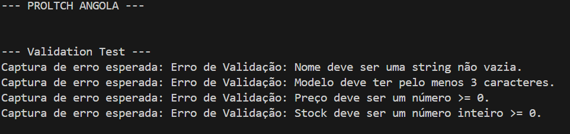
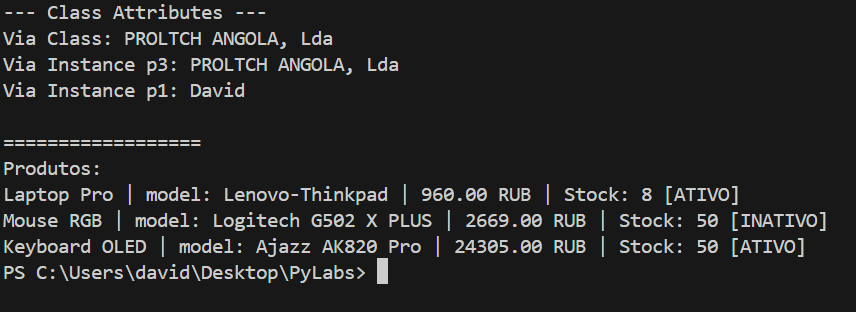

# LR-1 — Classe e Encapsulamento (Python 3. x)

# Objectivo do Trabalho (Variante 3)

* Domine a declaração de classes personalizadas
* Compreender o encapsulamento (campos privados)
* Implementar propriedades (@property)
* Sobrescreva métodos mágicos (`__str__`, `__repr__`, `__eq__`)
* Compreender a diferença entre atributos de classe e de instância

# Sobre o Projecto
## Classe Product
Este projeto implementa uma classe **Product** personalizada que modela um produto num sistema de venda online. A classe contém um atributo próprio: "store_name", que define o nome da loja a que os produtos pertencem; E também contém os atributos dos objetos: nome do produto, preço, stock e modelo do produto. O estado lógico do produto (ativo ou desactivo) é também foi implementado implementado.
### Atributo de Classe:
* store_name: atributo para dar nome à loja.
### Atributos de Instância (Campos privados):
* _name - nome do produto
* _price - preço do produto
* _stock - quantidade no stock da loja
* _model - modelo do produto
* _is_active - estado do produto (ativo/desactivo)
### Propriedades (@propriedade):
* Leitura: nome - nome do produto
* Leitura e Escrita: price - preço do produto
* Leitura: stock - quantidade no stock da loja
* Leitura: model - modelo do produto
* Leitura: is_active - estado do produto (ativo/desactivo)
### Métodos Mágicos:
* `__str__` — Apresentação conveniente de informações do produto, legível para o utilisador
* `__repr__` — representação técnica de um produto - apaenas para desenvolvedor
* `__eq__` — comparação de produtos por nome e modelo
### Métodos de Negócio:
* deactivate() - desactiva um produto
* eactivate() - activa um produto
* apply_discount(percentage) - aplica desconto ao produto
* sell(self, quantity) - vende o produto

*[Ver código competo de validation.py](../libraries/validation.py)* | *[Ver código competo de model.py](model.py)* | *[Ver código competo de demo.py](demo.py)*
# Demonstração do Projecto
**1. Testes de Stress (Validação e Robustez)**
* **Blocos try/except:** Em vez de o programa "crashar", ele retornará erros específicos (nome vazio, modelo curto, preço negativo, stock negativo) para provar que o ficheiro *[validation.py](../libraries/validation.py)* está a proteger a classe Product.

**2 . Auditoria de Inventário (O Coração da Lógica)**
* **Iventário com ciclo for aninhado:** Ao percorrer a lista inventory comparando cada item com os seguintes, o programa gera um cenário real de controlo de qualidade, verificando quais produtos são iguais em nome e modelo.
* **Interação com `__eq__`:** o comando "if inventory[i] == inventory[j]", faz com que o Python executa e automaticamente o código escrito em *[model.py](model.py)*, disparando o Warning e a sugestão de unificar stock. Isto automatiza a gestão da loja.

**3. Perspectivas de Visualização**
* **Vista Utilizador vs. Programador:** Para uma visualização estilosa e compreensivel para o utilizador, usamos o `__str__` (legível e com moeda), e para o desenvolvedor, usamos o `__repr__` (técnico). Isso ajuda muito na depuração de grandes sistemas.

**4. Ciclo de Vida e Regras de Negócio**
* **Teste de Fluxo:** Fez-se a simulação de uma sequência real: desativar -> tentar vender (bloqueio) -> ativar -> vender com sucesso.
* **Limite de Dados:** tentar vender quantidade de produto mais do há no stock: O sistema prova que respeita a quantidade física disponível, não permitindo vendas "fantasmas".

**5. Manipulação de Atributos de Classe e Instância**
* **Atributos de Classe:** A alteração do atributo de classe a partir da própria classe faz com que todas as instâncias sejam afetadas com esta alteração. É considerada como "Alteração Global".
* **Atributos de Instância:** A alteração do atributo de classe a partir de uma instância (objecto) de classe faz com que as alterações fiquem somente neste objecto, sem afetar os outros objectos. É considerada como "Alteração Local". No projecto, foi testada a alteração do nome da loja usando o atributo de classe e de instância através da planta geral, isto é, via classe (Product.store_name) ou de um objeto específico (p3.store_name).
* **Estado final do stock:** o projecto é consnstente e consegue actualizar o stock da loja e os estados actuais do produto.

