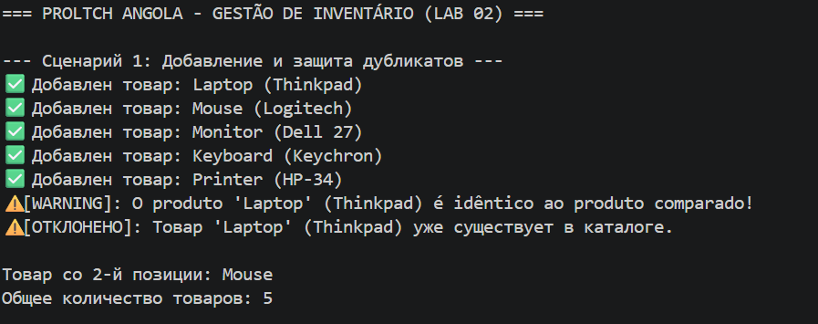
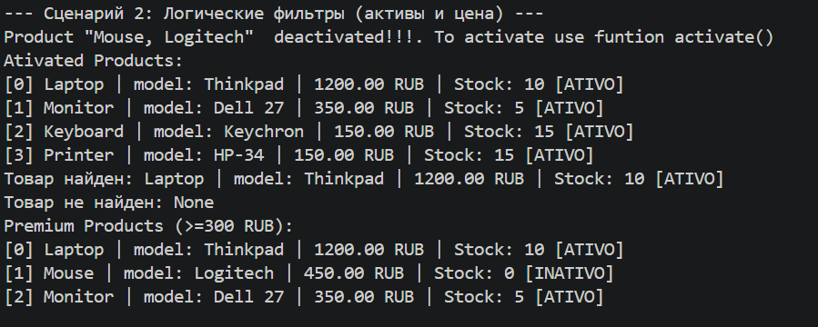
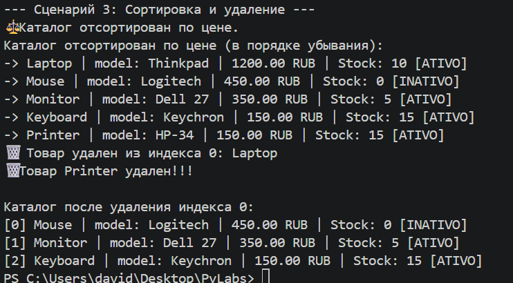

# ЛР-2 — Коллекция объектов

# Цель работы
* Научиться работать с коллекциями объектов.
* Понять разницу между моделью сущности и контейнером объектов.
* Реализовать собственный контейнерный класс.
* Освоить итерацию по объектам.
* Реализовать базовые операции управления коллекцией.

# О проекте
## Описание класса контейнера ProductCatalog:
A classe ProductCatalog é um contêiner para armazenar e gerenciar objetos da classe  *[Product](../lab01/model.py)* (feita no primeiro laboratório).
Ela fornece gerenciamento seguro de coleções: adicionar, excluir, pesquisar por nome, classificar e filtrar objetos.
### Principais funcionalidades:
* Gerenciamento — Adicionar, excluir, acessar por índice
* Busca — Por nome
* Classificação — Por preço
* Filtragem — Recuperação de subcoleções (em estoque, descontinuado, caro, barato)
* Armazenamento — Lista de objetos Produto
* Iteração — Suporte a laços de repetição
* Segurança — Verificação de tipo, prevenção de duplicatas

## Методы коллекции
### Operações Básicas de Gestão
* add(item) — добавить товар
* get_all() — получить список всех товаров

### Métodos Mágicos
* `__len__` — получение количества
* `iter` — итерация
* `__getitem__` — доступ по индексу
* `__str__`— Удобное представление информации о продукте, понятное пользователю
### Métodos para Remoção e Busca
* remove(item) — удалить товар
* remove_at(index) — удалить по индексу
* find_by_name(name) — Поиск по имени

### Métodos de ordenação e filtros
* sort_by_price() — Расположите товары по цене в порядке убывания.
* get_active() — Возвращает новую коллекцию, содержащую только активные товары.
* get_expensive_products(min_price) — дорогие товары 

# Демонстрация проекта

###  --- Сценарий 1: Добавление и защита дубликатов ---

###  --- Сценарий 2: Логические фильтры (активы и цена) ---

###  --- Сценарий 3: Сортировка и удаление ---

