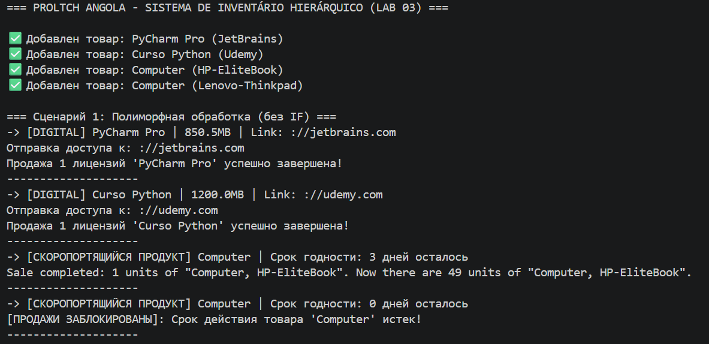
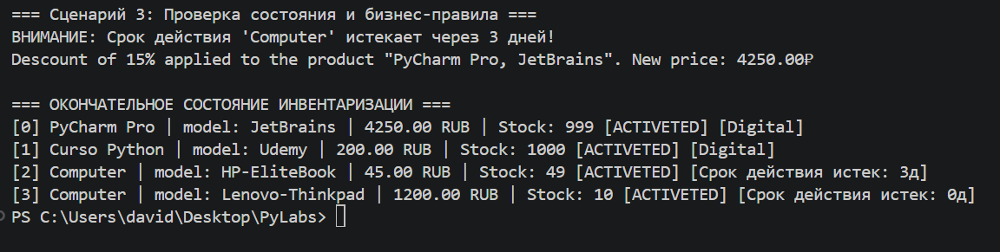

# ЛР-3 — Наследование и иерархия классов

# Цель работы
* Освоить механизм наследования классов.
* Научиться строить иерархию объектов.
* Понять разницу между:
* базовым классом
* производным классом
* Научиться переиспользовать код.
* Освоить методы переопределения.

№ 1. О проекте
Целью этой лабораторной работы была реализация передовых концепций объектно-ориентированного программирования (ООП), уделяя особое внимание:
* **Наследование:** повторное использование логики базового класса Product (лабораторная работа 01).
* **Полиморфизм.** Создание общего интерфейса, в котором разные объекты по-разному реагируют на один и тот же метод.
* **Инкапсуляция.** Поддержание правил проверки через иерархию.

# 2. Описание иерархии классов и методов
Структура была организована таким образом, чтобы избежать дублирования кода и обеспечить возможность расширения системы:

* **Базовый класс (Product):** Содержит основные атрибуты (имя, модель, цена, наличие на складе).

* **Промежуточный интерфейс (BaseProduct - base.py):** Определяет контракт get_details().

* **Дочерние классы (в models.py):**
* **DigitalProduct:** Специализируется на нематериальных товарах.

* ``__init__:`` Использует super() для инициализации базовых данных.

* ``sell()`` **(Переопределение/Полиморфизм):** Изменяет исходное поведение.

+ ``get_details()``: Реализует общий интерфейс.

+ ``__str__:`` Настраивает отображение для пользователя.

* **PerishableProduct:** Специализируется на потребительских товарах.

* ``__init__`:`` В дополнение к базовым данным инициализирует атрибут ``expiry_days`.

* ``sell()`` **(Переопределение/Полиморфизм):** Добавляет важнейшее бизнес-правило: проверяет, истек ли срок годности товара. Если да, продажа блокируется. В противном случае используется super().sell() для выполнения стандартной логики уменьшения запасов.

* ``check_expiration()`` **(Специфический метод):** Уникальный метод, анализирующий риск истечения срока годности.

* + ``get_details()``: Реализует общий интерфейс, ориентированный на информацию об оставшемся сроке годности.

+ ``__str__`:`` Добавляет статус срока годности в представление в удобочитаемом виде.

# 3. Демонстрация проекта

## --- Сценарий 1: Чистый полиморфизм ---
Итерация по смешанному списку в ``ProductCatalog``. Вызов функций ``item.get_details()`` и ``item.sell()`` для всех товаров.

+ **Результат:** Система корректно обрабатывает каждый товар без использования блоков if/else для проверки типа. Поведение определяется самим объектом во время выполнения.

## --- Сценарий 2: Фильтрация по типу ---
Функция ``isinstance()`` использовалась для извлечения из глобальной коллекции только товаров типа DigitalProduct.

+ **Результат:** Демонстрирует интеграцию между коллекцией Lab 02 и новой иерархией.

## --- Сценарий 3: Super() и специфические методы ---
Использование ``super().sell()`` было протестировано на скоропортящемся продукте, чтобы убедиться, что, если срок годности продукта еще не истек, выполняется исходная логика уменьшения запасов (из лабораторной работы 01).

+ **Результат:** Полная проверка повторного использования кода. 

# 4. Заключение
В ходе этой лабораторной работы стало ясно, что наследование используется не только для копирования кода, но и для создания логических категорий. Полиморфизм оказался наиболее мощным инструментом для поддержания чистоты кода, позволяя каталогу товаров расти за счет новых типов (например, услуга, подписка) без необходимости изменения основного цикла продаж в demo.py.