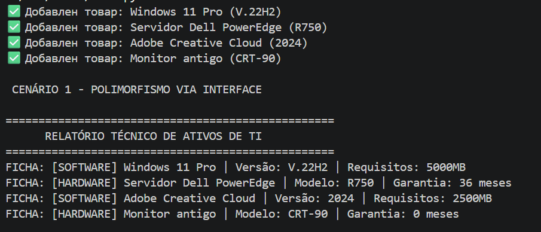
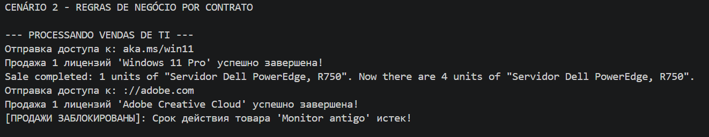
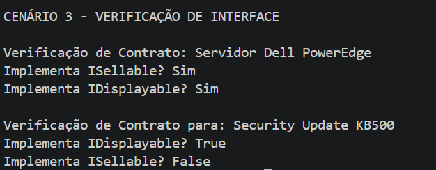

# ЛР-4 — Интерфейсы и абстрактные классы (ABC)

# 1. Цель работы
Aprofundar os conceitos de **abstração** e **múltipla herança,** focando em:
+ **Абстрактные базовые классы (АБК):** Определение шаблонов, которые нельзя создать напрямую.
+ **Интерфейсы:** Создание обязательных контрактов поведения.
+ **Множественная реализация:** Возможность класса подписывать и выполнять несколько контрактов одновременно.
+ **Полиморфизм через интерфейсы:** Манипулирование объектами на основе того, что они «умеют делать», а не на основе того, чем они «являются».
# 2. О проекте
В этой лабораторной работе система учета была преобразована в модель управления ИТ-активами с использованием следующих интерфейсов:
## Интерфейсы (interfaces.py)
+ **ISellable:** требует реализации метода ``sell()``. Гарантирует, что система продаж обрабатывает только товары, пригодные для продажи.
+ **IDisplayable:** требует реализации метода ``get_technical_sheet()``. Гарантирует, что каждый ИТ-актив предоставляет свои технические характеристики стандартизированным образом.
## ИТ-классы (models.py)
**Множественное наследование** для объединения данных из предыдущих лабораторных работ с новыми контрактами:
+ **SoftwareProduct:** наследует от ``DigitalProduct`` (Лабораторная работа 03) и реализует ``ISellable`` и ``IDisplayable``. Сосредоточен на версиях и ссылках для скачивания.
+ **HardwareProduct:** Наследует от ``PerishableProduct`` (Лабораторная работа 03) и реализует ``ISellable`` и ``IDisplayable``. Использует логику истечения срока действия для представления **технической гарантии.**
+ **SystemPatch** (Протокол): Наследует только от ``IDisplayable``. Служит для демонстрации отрицательной фильтрации в системе.

# 3. Демонстрация проекта (demo.py)

##  --- Сценарий 1: Интерфейсы как типы (ПОЛИМОРФИЗМ ЧЕРЕЗ ИНТЕРФЕЙС) ---

##  --- Сценарий 2: Фильтры по типу ---

##  --- Сценарий 3: Проверка интерфейса ---
