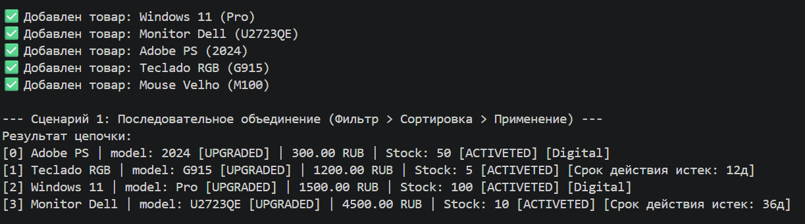
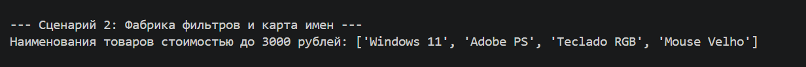
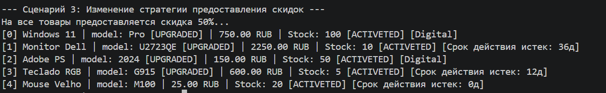

# LR-5 — Функции как аргументы. Стратегии и делегаты

# 1. Цель работы
+ Освоить передачу функций как аргументов в другие функции и методы.
+ Научиться применять встроенные функции высшего порядка: ``map``, ``filter``, ``sorted``.
+ Понять концепцию паттерна «Стратегия» и реализовать его на Python.
+ Освоить ``lambda``-выражения и их практическое применение.
+ Интегрировать функциональный стиль с объектно-ориентированным кодом из предыдущих ЛР.

# 2. О Проекте
Основная цель этой лабораторной работы — сделать каталог товаров гибким, позволяя внедрять поведение (например, сортировку, фильтрацию и модификацию) извне через функции, лямбда-выражения и вызываемые объекты (Callables).


## I. Функции высшего порядка (Higher-Order Functions)
* ``filter():`` Используется для создания подколлекций на основе логических критериев.
+ ``map():`` Используется для преобразования данных или применения пакетных действий (например, скидок).
+ ``sorted():`` Используется для сортировки каталога без уничтожения исходного списка.

## II. Стратегии сортировки (``strategies.py``)
Функции, используемые в качестве критериев для организации каталога:
* ``sort_by_name:`` Преобразует название в нижний регистр и сортирует от A до Z.
+ ``sort_by_price_asc:`` Сортирует товары от самой низкой цены к самой высокой.
+ ``sort_by_stock_and_price:`` Сначала сортирует по количеству на складе, а затем по цене.

## III. Функции фильтрации
Критерии выбора подмножеств продуктов:
+ ``filter_by (lambda):`` Быстрые фильтры (``например: p.price > 100``), определенные во время выполнения.
+ ``isinstance (Type Filter):`` Фильтрует продукты по категории (например, только ``SoftwareProduct``).

## IV. Фабрика функций (Closures)
Функции, генерирующие другие пользовательские функции:
```make_price_filter(max_price):`` Создает функцию, которая проверяет, ниже ли цена продукта определенного предела.

## V. Вызываемые объекты (Strategy Pattern)
Классы, которые поддерживают состояние и могут вызываться как функции:
+ ``DiscountStrategy(percentage):`` Вычисляет и применяет процентную скидку к ценам продуктов.
+ ``TechUpgradeStrategy():`` Изменяет строку модели продукта, чтобы отметить техническое обновление.

## VI. Методы высшего порядка (``collection.py``)
Методы ``AdvancedProductCatalog``, обрабатывающие коллекцию:
+ ``filter_by(predicate):`` Возвращает новый каталог, содержащий только те элементы, которые удовлетворяют условию.
+ ``sort_by_strategy(key_func):`` Генерирует упорядоченную версию каталога на основе стратегии ключей.
+ ``apply(func):`` Применяет преобразование или действие ко всем товарам в исходном списке.
+ ``get_names_list():`` Использует ``map`` для извлечения только названий товаров из коллекции.


# 3. Демонстрация проекта (demo.py)

## --- Сценарий 1: Последовательное объединение (Фильтр > Сортировка > Применение) ---


## --- Сценарий 2: Фабрика фильтров и названия карт ---



## --- Сценарий 3: Изменение стратегии предоставления скидок ---


# 4. Заключение
Использование функционального программирования позволило создать систему, в которой **«что делать»** (Каталог) отделено от **«как делать»** (стратегии), что упрощает обслуживание и расширение программного обеспечения.