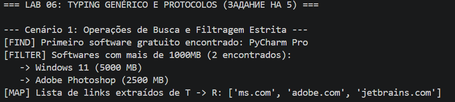
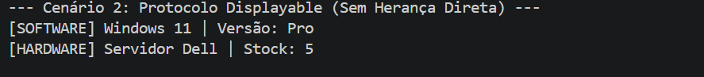
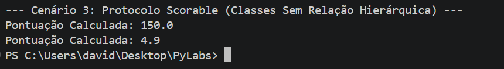

# Laboratório 06: Generics, Typing и Protocols

## 1. Objetivo
Aprender tipagem estática avançada em Python usando o módulo `typing`. O objetivo principal é criar um contêiner de dados genérico (`Generic`) e implementar tipagem estrutural (polimorfismo sem herança) usando `Protocol`.

---

## 2. Componentes Implementados

### 2.1. Coleção Genérica (`container.py`)
**Classe `TypedCollection[T]`:** substitui as estruturas de dados padrão, garantindo a verificação de tipos durante a análise estática (IDE / Mypy).

* **`TypeVar('T')`:** Parâmetro de tipo base para elementos da coleção.
* **`TypeVar('R')`:** Parâmetro de tipo de retorno para transformações.
* **`TypeVar('D', bound=Displayable)`:** Parâmetro de tipo restrito ao protocolo ``Displayable``
* **`TypeVar('S', bound=Scorable)`:** Parâmetro de tipo restrito ao protocolo ``Scorable``

### 2.2. Métodos Funcionais
Conforme necessário, métodos de ordem superior seguros foram adicionados ao contêiner:
* **`find(predicate: Callable[[T], bool]) -> Optional[T]`**: Retorna o primeiro elemento que satisfaz a condição ou `None`.
* **`filter(predicate: Callable[[T], bool]) -> List[T]`**: Filtra a coleção, preservando o tipo original do elemento.
* **`map(transform: Callable[[T], R]) -> List[R]`**: Converte elementos da coleção do tipo `T` para o tipo `R`.

### 2.3. Protocolos Estruturais
Em vez da herança de classes clássica, o mecanismo de **Duck Typing** é implementado por meio de `typing.Protocol`:
* **`Displayable`**: Requer que um objeto possua o método `display() -> str`.
* **`Scorable`**: Requer que um objeto possua o método `score() -> float`.
* **Restrições de tipo (`bound=`)**: Variáveis ​​de tipo delimitadas são criadas para isolar interfaces incompatíveis.

---
## 3. Demonstração (`demo.py`)

    3.1. **Encontrar e Filtrar**:

Encontra software livre usando `find` e filtra produtos digitais grandes (`>1000MB`) usando `filter` sem usar loops `for` manuais.

    3.2. **Transformação de Estrutura (Mapa)**:
Transformação de uma coleção de objetos `SoftwareProduct` em uma lista simples de strings (links para download).

    3.3. **Polimorfismo sem Herança (Protocolos)**:
Combinação de classes completamente diferentes (`SoftwareProduct` e `CustomerReview`) em uma única coleção `TypedCollection[Scorable]`. O código funciona corretamente porque ambas as classes implementam estruturalmente o método `score()`.

---
## 4. Conclusão
O uso de `Generic` e `Protocol` permite detectar erros de incompatibilidade de tipos antes de executar o programa.