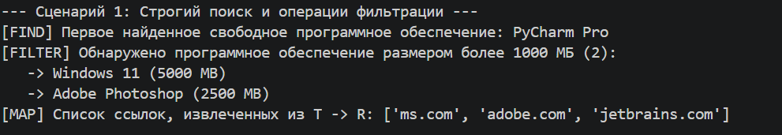
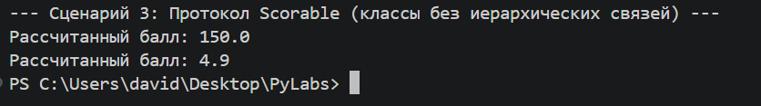

# Лабораторная работа 06: Обобщения, типизация и протоколы

## 1. Цель
Изучить расширенную статическую типизацию в Python с использованием модуля `typing`. Основная цель — создать универсальный контейнер данных (`Generic`) и реализовать структурную типизацию (полиморфизм без наследования) с использованием `Protocol`.

---

## 2. Реализованные компоненты

### 2.1. Обобщенная коллекция (`container.py`)
**Класс `TypedCollection[T]`:** заменяет стандартные структуры данных, обеспечивая проверку типов во время статического анализа (IDE / Mypy).

* **`TypeVar('T')`:** параметр базового типа для элементов коллекции.
* **`TypeVar('R')`:** параметр возвращаемого типа для преобразований.
* **`TypeVar('D', bound=Displayable)`:** Параметр типа, ограниченный протоколом ``Displayable``
* **`TypeVar('S', bound=Scorable)`:** Параметр типа, ограниченный протоколом ``Scorable``

### 2.2. Функциональные методы
При необходимости в контейнер добавлены безопасные методы высшего порядка:
* **`find(predicate: Callable[[T], bool]) -> Optional[T]`**: Возвращает первый элемент, удовлетворяющий условию, или `None`.
* **`filter(predicate: Callable[[T], bool]) -> List[T]`**: Фильтрует коллекцию, сохраняя исходный тип элемента.
* **`map(transform: Callable[[T], R]) -> List[R]`**: Преобразует элементы коллекции из типа `T` в тип `R`.

### 2.3. Структурные протоколы
Вместо классического наследования классов, механизм **утиной типизации** реализован с использованием `typing.Protocol`:
* **`Displayable`**: Требует, чтобы объект имел метод `display() -> str`.
* **`Scorable`**: Требует, чтобы объект имел метод `score() -> float`.
* **Ограничения типов (`bound=`)**: Создаются переменные с ограниченными типами для изоляции несовместимых интерфейсов.

---
## 3. Демонстрация (`demo.py`)

    3.1. **Поиск и фильтрация**:

Находит свободное программное обеспечение с помощью `find` и фильтрует большие цифровые продукты (`>1000 МБ`) с помощью `filter` без использования ручных циклов `for`.

    3.2. **Преобразование структуры (карта)**:
Преобразование коллекции объектов `SoftwareProduct` в простой список строк (ссылки для скачивания).

    3.3. **Полиморфизм без наследования (протоколы)**:
Объединение совершенно разных классов (`SoftwareProduct` и `CustomerReview`) в единую коллекцию `TypedCollection[Scorable]`. Код работает корректно, поскольку оба класса структурно реализуют метод `score()`.

---
## 4. Заключение
Использование `Generic` и `Protocol` позволяет обнаруживать ошибки несовместимости типов до запуска программы.